# Harbor: Automated Harness Optimization

*A constrained-noisy-BO formulation, a reference algorithm, and a production case study*

Source: [arXiv:2604.20938v1](https://arxiv.org/abs/2604.20938) (22 Apr 2026). [PDF](https://arxiv.org/pdf/2604.20938).

- **Biswa Sengupta, Jinhua Wang** — Affiliation: LLM Suite Team, JP Morgan Chase & Co. Email: {biswa.sengupta, jinhua.wang}@jpmorgan.com

## Abstract

Long-horizon language-model agents are dominated, in lines of code and in operational complexity, not by their underlying model but by the *harness* that wraps it: context compaction, tool caching, semantic memory, trajectory reuse, speculative tool prediction, and the glue that binds the model to a sandboxed execution environment. We argue that harness design is a first-class machine-learning problem and that automated configuration search dominates manual stacking once the flag space exceeds a handful of bits. We defend this claim in two steps. First, we formalize *automated harness optimization* as constrained noisy Bayesian optimization over a mixed-variable, cost-heterogeneous configuration space with cold-start-corrected rewards and a posterior chance-constrained safety check, and give a reference solver, Harbor (Harness Axis-aligned Regularized Bayesian Optimization Routine), built from a block-additive SAAS surrogate, multi-fidelity cost-aware acquisition, and TuRBO trust regions. Second, we instantiate the problem in a flag-gated harness over a production coding agent and report a controlled four-round manual-tuning case study against a fixed task suite and an end-to-end Harbor run. The formulation itself is task-class agnostic: the configuration space, reward correction, acquisition, and safety check apply to any agent harness with a bounded flag space and a reproducible task suite.

***Disclaimer:*** *This paper was prepared for informational purposes by the LLM Suite group of JP Morgan Chase and its affiliates (‘JPMC’) and is not a product of the Research Department of JP Morgan. JP Morgan makes no representation, warranty or undertaking whatsoever and disclaims all liability for the completeness, accuracy or reliability of the information contained herein. This document is not intended as investment research or investment advice, or a recommendation, offer or solicitation for the purchase or sale of any security, financial instrument, financial product or service, or to be used in any way for evaluating the merits of participating in any transaction, and shall not constitute a solicitation under any jurisdiction or to any person, if such solicitation under such jurisdiction or to such person would be unlawful.*

## I. Introduction

The last eighteen months have seen a qualitative shift in how large language models (LLMs) are deployed for long-horizon work. The archetypal 2024 system—a prompt, a single model call, a returned string—has been displaced by “Agents 2.0” or *Deep Agent* stacks that decouple planning from execution, externalize memory, and delegate to specialized sub-agents [3]. In this regime most of the engineering is neither the model nor the prompt: it is the **harness**, the deterministic code that stores, retrieves, and serves context to the model, enforces tool semantics on its outputs, and shields it from the failure modes that destroy long-horizon runs [19]. A systematic audit of Claude Code [7] estimates that $\approx$ 98.4% of its codebase is harness—permission gates, multi-stage context compaction pipelines, tool routing, failure recovery—and only $\approx$ 1.6% is the AI decision logic itself. A 100-tool agent that does not aggressively manage tool descriptions can squander up to 40% of its context window before processing a single user instruction [19]; the same harness must defend against *context poisoning*, where a hallucinated variable becomes a self-reinforcing premise across hundreds of turns.

This paper is about the *optimization* problem that the harness creates. Teams today tune harnesses by hand: they add a cache, run an ablation, read a few pass-rate tables, and ship or revert. We report on doing exactly this in a real system— `codex-py` [40], a production Python port of the OpenAI Codex CLI that, on Terminal-Bench, reaches parity with its 648K-LOC Rust original in just 52K LOC and ships an enhancement layer of $\approx 30$ flag-gated capabilities—over four tuning rounds against Terminal-Bench 2 [38]. Each round (A, B, C, D) layers *additional* features on top of the $\approx\!30$ enhancements already present in the base `codex-py` harness; the flags we tune in A–D are strictly above and beyond that baseline, drawn from the recent agent-optimization literature: Reflexion-style failure-self-reflection [34]; PASTE (Predictive Agent-Side Tool Execution) speculative tool execution [29]; ACON (Agent-Context Observation compressioN) gated observation compression [2]; a Terminus-KIRA [39] inspired self-evaluation gate; intent-canonicalized, content-addressable tool-result caching in the style of Liu et al. [32]; tiered conversation compression backed by the TurboQuant [43] vector quantizer, which matches the Shannon distortion-rate lower bound to within a small constant ($\approx\!2.7$) and reaches absolute quality neutrality at 3.5 bits per channel; a prompt-prefix-first context layout grounded in observed Claude Code reuse patterns [25]; and a cross-session experience library. Features are flag-gated so that the same model and the same task set can be run with each subset enabled.

The results are sobering (§V). Of the four tuning rounds, only B cleanly beat the no-harness-extension baseline, scoring 17/89 against an all-flags-off baseline of 15/89 and an Oracle (best-of-all-configurations union) of 81/89. Adding self-evaluation on top of B dropped the full-suite score to 13/89 (C, $-4$); adding the full ACON+Reflexion+PASTE bundle on top of that dropped it further to 12/89 (D, $-5$). The headline causes are cross-cutting and unsurprising in hindsight—low-capability self-evaluators make worse not better outputs; the ACON observation gate corrupts the tool-result cache by storing the compressed *summary* rather than the raw output, so later retrievals reason on truncated context; cold-start crippling of cross-session features; and two silent integration bugs (cross-trial reflection memory was not propagated between containers, and PASTE’s next-tool predictor was never wired into the runner). These are precisely the sort of causes that a manually driven ablation loop is poorly equipped to find.

We take this as evidence that harness tuning has graduated from a systems problem into a hyper-parameter optimization problem, and that it should be treated with the same rigor [36, 24, 17]. Our contributions are four:

- A characterization of our flag-gated `codex-py` harness as a high-dimensional flag-valued configuration space (§III, §IV), with a taxonomy of the six non-trivial interaction dimensions that make hand-tuning lossy.
- A frankly negative case study showing how a well-motivated, literature-grounded manual tuning cadence over four rounds produces at most one statistically credible net win under a compute and time budget representative of industry practice (§V).
- A formalization of *Automated Harness Optimization* (AHO) as constrained noisy optimization over a structured, cost-heterogeneous configuration space, and a reference algorithm—Harbor (Harness Axis-aligned Regularized Bayesian Optimization Routine)—that combines Bayesian optimization over the flag bundle with a per-task-difficulty meta-controller and a cold-start-aware evaluator (§VI).
- End-to-end measurements against a fixed task suite (§VIII), together with the harness-level telemetry counters that make the warm-start-aware evaluator (Eq. 3) computable in practice. Concrete model/benchmark identities are deferred to §VII.

Fig. 1: Harbor schematic. A flag-space $\times$ fidelity input $(x,m)$ is scored by a block-additive SAAS surrogate; a cost-aware acquisition selects the next batch; runtime telemetry (dashed) feeds Axis-IV silent-flag auto-exclusion, which prunes dimensions from the surrogate in place. The output is a Pareto front on (pass-rate, cost), from which a single deployment configuration is picked subject to the posterior chance-constrained safety check.

**We emphasize that our claims are empirical and “in the small”; a single-benchmark, single-agent ablation is the right grain for the engineering loop, but not for conference-grade claims of universality. Our purpose is to motivate automation, not to declare any single configuration optimal.** Although we use a coding benchmark (Terminal-Bench 2) as a concrete reference and `codex-py` as the harness under test, nothing in the formulation of §VI is specific to code: the same flag-valued configuration space, cold-start-corrected reward, cost-aware acquisition, and posterior chance-constrained safety check apply to any agent-orchestration harness with a bounded flag space and a reproducible task suite—retrieval-augmented QA agents, customer-support copilots, web-browsing agents, scientific tool-use agents, and so on. The coding setting is a convenience for measurement; the method is for agent orchestration in general. Figure 1 summarizes the mechanism the rest of the paper defines.

**The case for mechanics over stacking.**

A structural lesson runs through our case study and its automated counterpart: on any given (model, benchmark) pair, net-positive harness features are a small, class-specific subset of the published inventory, and the expected return from stacking more published techniques is negative once the effective flag space saturates the per-model signal-to-noise ratio. This is not a claim that a given published technique is wrong—Reflexion, ACON, PASTE, Terminus-KIRA-style self-evaluation, and intent-canonical caching each have strong empirical results at the scale and layer for which they were designed. It is a claim that (i) the per-class-architecture pick (flag-space composition) is the load-bearing design decision, not the per-flag ON/OFF switch; (ii) component-internal tuning—thresholds, fidelity ladders, retrieval top-$k$, cache-key canonicalization—is where most of the headline improvement lives; and (iii) the optimizer’s job is to surface that structure mechanically, not to certify whether a technique is “good.” The rest of this paper is organised accordingly: we define the mechanics, then show what they recover on a concrete suite, rather than arguing for or against any individual published harness feature.

## II. Related Work

**Harness as first-class subject.**

The industrialization of LLM coding agents has pushed harness engineering into its own research stack [19, 3]. The “Agents 1.0 $\to$ Agents 2.0” / Deep-Agents transition [3] reframes the harness as the component responsible for decoupling planning from execution, maintaining externalized memory, and delegating to specialized sub-agents. A frequently cited datum from a systematic audit of Claude Code [7] places $\approx$ 98.4% of its codebase in the deterministic harness (permission gates, context pipelines, tool routing, failure recovery) and only $\approx$ 1.6% in model-facing decision logic. Adjacent work has begun to decompose this harness by layer: key–value (KV) cache disaggregation and hierarchical memory (Pancake, Mem0, STITCH) [28]; prompt-prefix caching as practiced in Claude Code [25]; five-stage context-compaction pipelines [19]; and AI gateways (Kong, Bifrost, Portkey, LiteLLM) with their own token-bucket rate-limiting and PII-masking guardrails. Our paper treats a *subset* of this surface—the high-level harness feature flag space on top of a single API gateway—as an explicit optimization problem, not as an architectural one.

**Automated harness engineering.**

The closest prior work to ours is **Meta-Harness** [26], an outer-loop system in which an LLM proposer reads the source code, logs, and benchmark scores of previously evaluated candidate harnesses and writes a new one. Meta-Harness reports $+7.7$ absolute accuracy points on LawBench with $4\times$ fewer context tokens against hand-engineered baselines, and establishes the credit-assignment shift from model weights to harness code that our paper then *formalizes*. Complementary efforts include **ACCLAIM** [1], which couples an LLM agent with a compiler to iterate on generated code using hardware profiling feedback; and Datadog’s **BitsEvolve** [5], which builds “harness-first” observability loops so that failing outputs are automatically routed back to the agent for correction. These systems evolve harness *code*; our AHO framework searches the harness *configuration* surface with cost-aware Bayesian optimization, and the two are complementary.

**Agent benchmarks.**

Terminal-Bench [38] and SWE-bench Verified [21] have become the two standard targets for long-horizon coding agents. Both are deliberately task-independent, which we show (§V) amplifies the cold-start penalty for any harness feature that is designed to accumulate cross-task state. The EleutherAI LM Evaluation Harness [16] provides a widely-used tokenization-agnostic interface for running such benchmarks reproducibly. The Terminus-KIRA team [39] has reported 10-percentage-point improvements from harness-only changes on these benchmarks; our B result is consistent with the lower end of their estimates.

**Harness components.**

The five core harness features we evaluate map onto an existing literature: tool-result caching and fuzzy retrieval [22]; Reflexion failure-reflection [34]; recursive memory trees [31]; speculative tool execution [29]; ACON gated observation compression [2]; and tiered embedding compression via the TurboQuant quantizer [43]. Binary-embedding and Matryoshka-style two-stage retrieval [23, 20] are natural next steps on top of the current single-stage semantic cache but are *not* implemented in the harness evaluated here; we include them only in the forward-looking discussion (§IX). Semantic caching at the *gateway* layer has its own substantial theory: the mismatch-cost framework of Liu et al. [32] proves that the oracle setting is NP-hard and solves a Reverse Greedy relaxation, with a CUCB-SC (Combinatorial Upper Confidence Bound for Semantic Caching) offline learner for the partial-information regime and a CLCB-SC-LS (Combinatorial Lower Confidence Bound for Semantic Caching with List-Swap updates) online adaptive variant; these are the natural algorithmic cousins of the acquisition function in §VI. Dynamic model routing [6, 35, 18] completes the layer cake. Each of these components has independently justified empirical benefits; our observation is that stacking them is not additive.

**Hyper-parameter optimization.**

Bayesian optimization for expensive black boxes has been studied for more than a decade [36, 37]; multi-fidelity [24] and combined BO+bandit [17] approaches handle heterogeneous evaluation cost. We borrow directly from this literature in §VI and are, to our knowledge, the first to apply it to harness *configuration* (as opposed to harness code, à la Meta-Harness) for LLM agents.

## III. The `codex-py` Harness

`codex-py` is a production Python port of the OpenAI Codex CLI [40]. The port is a 12.3 $\times$ code reduction from the Rust original ($\approx$ 52K Python LOC versus $\approx$ 649K Rust LOC) and is organized into six architectural layers: an *agent* layer (turn loop, tool orchestration, guardian approval, multi-agent coordination, memory); a *security* layer (Seatbelt/Bubblewrap/seccomp sandboxing and execution-policy evaluation); a *protocol* layer (wire types, approval workflows, model abstractions); an *integration* layer (Model Context Protocol client/server, OAuth authentication, backend API); a *presentation* layer (terminal UI and application server); and an *infrastructure* layer (persistent state, configuration, telemetry, feature flags). The harness ships 34 tool handlers— including shell execution, a unified file-patch tool, directory listing, and a Model Context Protocol delegate—plus a layered three-stage approval pipeline (policy check, guardian LLM risk assessment, interactive prompt) [40]. From a configuration standpoint, we group the *harness* surface exposed to our ablations into five layers:

- **Runtime.** A stateful turn loop owns dispatch, tool invocation, and exit conditions; it is the single integration point for all harness extensions and emits typed events consumed by the presentation and telemetry layers.
- **Tool handlers.** A set of file tools (read, grep, glob, write, edit) plus shell and apply-patch, each with a read/write and concurrency declaration that the harness respects when parallelizing tool calls.
- **Context management.** A multi-phase compactor applies microcompaction (inline stale-output stripping), snip compaction (token-threshold pruning), and full LLM-driven summarization, with post-compact file restoration and ghost snapshots [40]. A flag-gated family of compaction policies—an ACON-style gate, TurboQuant-based tail compression, an incremental strategy, an intent anchor, and a forked variant—sit on top of this substrate.
- **Cross-session memory.** Two storage backends—a TurboQuant-compressed index of (task embedding, hint) pairs and a trajectory-based experience library—persist compressed embeddings across sessions and retrieve few-shot hints when a new task embeds close to historical ones.
- **Resilience / self-evaluation.** A categorized-retry resilience family is complemented by a self-evaluation gate in the runtime layer that fires a checklist-driven review before submission, in the style of Terminus-KIRA [39].

Feature selection is unified by a four-tier flag-resolution scheme (runtime override $>$ build-time compile flag $>$ environment variable $>$ default); this follows the enhancement-layer design principle of keeping every addition strictly opt-in, so that “all enhancement flags off” reproduces the Rust-parity baseline exactly [40]. The production port exposes $\approx$ 35 enhancement flags across multi-agent orchestration, safety (guardian), tool extensions, memory, context management, productivity, session coherence, IDE integration, and observability. For this paper the nine relevant flags, all defaulting off, are five native harness feature flags (semantic tool-result cache, cross-session memory index, tiered conversation compressor, trajectory-replay experience library, speculative tool-prediction learner), plus the self-evaluation gate, the ACON observation-compression gate, the Reflexion reflections module, and the PASTE next-tool predictor.

## IV. The Harness Feature Layer over `codex-py`

The harness we evaluate packages five flag-gated extensions on top of `codex-py`. Two of these extensions (the cross-session memory index and the tiered conversation compressor) use TurboQuant as a vector-compression primitive; the remaining three (semantic tool-result cache, trajectory-replay experience library, speculative tool-prediction learner) are TurboQuant-free. Because the quantizer is shared by the compression-heavy extensions, we describe it first, but we emphasize that the harness is a collection of flag-gated mechanisms, not a TurboQuant-derived system. TurboQuant [43] is, in its original form, an online data-oblivious vector quantizer that achieves near-optimal distortion rates for both mean-squared error and inner-product error. Its core is a two-stage construction: first a random rotation of the input vector induces a concentrated Beta distribution on each coordinate, on which a per-coordinate Lloyd–Max quantizer—obtained by solving a continuous $k$-means problem—is MSE-optimal; second, a one-bit Quantized Johnson–Lindenstrauss (QJL) transform is applied to the residual, yielding an unbiased inner-product estimator [43]. The resulting quantizer provably matches the information-theoretic distortion–rate lower bound up to a small ($\approx 2.7$) constant, and on KV-cache quantization achieves absolute quality neutrality at $3.5$ bits per channel and marginal degradation at $2.5$ bits [43]. Two properties make it a natural primitive for agent harnesses: it is (i) *data-oblivious*, so no codebook fitting is required when embeddings drift across sessions, and (ii) accelerator-friendly (the quantizer is a composition of a rotation, a scalar look-up table (LUT), and a bitwise reduction), so it can sit on the tool-result hot path without dominating latency.

In our harness, TurboQuant provides the compression primitive underneath four extensions:

1. **Semantic tool-result cache (PolarCache).** A tool-result cache keyed both exactly and by compressed-inner-product similarity. Cache keys include the target file’s POSIX modification time (`mtime`) as a secondary component, so that a stale entry is *structurally* unreachable after the underlying file changes—rather than relying on a separate invalidation pass. An *intent-canonical* hash on the primary component maps surface-form variants of a file-read (e.g. print-file, head, tail, pager, and structured read) onto a single canonical tuple. The design follows the intent-canonicalization line of work that directly diagnoses the $\leq$ 40% hit-rate ceiling of string-level agent caches [32].
2. **Cross-session memory index (PolarMemoryIndex).** A cross-session index of (task embedding, hint text) pairs with a memory-type facet used to segregate Reflexion-style reflections [34] from trajectory hints. The structure follows the Zettelkasten-style agentic memory line of work that attaches LLM-generated keywords and contextual descriptions to each stored note.
3. **Tiered conversation compressor.** Keeps recent turns at full precision and TurboQuant-compresses the tail; retrieval sits behind a fixed-token compaction trigger. The tiered decomposition mirrors TurboQuant’s own two-stage quantization—coarse compression of stale content, fine retrieval over a recent window.
4. **Trajectory-replay experience library.** Records successful *and* failing trajectories with $[\mathrm{OK}]$ / $[\mathrm{FAIL}]$ markers and injects them as few-shot hints when the current task embedding exceeds a similarity threshold against past tasks.

A fifth native flag, the **speculative tool-prediction learner (PASTE)**, is *not* TQ-backed: it is a pure pattern-matching predictor that learns explicit tuples of the form (*context*, *next tool*, *argument-derivation function*, *probability*) from trajectories and speculatively fires the predicted tool when the tuple’s probability crosses a threshold, following PASTE [29]. The online path performs zero embedding or LLM calls; prediction is a dict lookup on $(tool,status)$ n-grams over recent history. We include it in the enhancement layer because, like the TQ-backed components, it exploits cheap structural signals to reduce model calls on the hot path—but the compression primitive it relies on is discrete tuple-counting, not quantized inner products.

Beyond these five native flags we also evaluate three published-technique flags introduced in later rounds: **the self-evaluation gate**, which interposes a second critic-style model call between the agent’s draft answer and final submission and either confirms or rewrites it, in the style of Terminus-KIRA [39]; **the ACON observation-compression gate**, which detects large, redundant tool outputs (long logs, directory listings, JSON blobs) and substitutes a learned compressed summary in place of the raw observation in the next model turn [2]; and **the Reflexion reflections module**, which after a failed task writes a short natural-language “lesson” into the cross-session memory index keyed by task embedding, to be retrieved on subsequent runs of similar tasks [34].

A single session-scoped coordinator reads the flags at initialization and wires itself into the pre-tool-call, post-tool-call, session-start, session-end, and context-hint pathways of the runtime layer. Lazy-init failures in any single extension are caught and demoted to a *disabled* state while the originally requested flag is preserved in the telemetry record. This graceful-degradation policy serves two distinct purposes: (i) a broken extension (for example, a missing dependency or a malformed threshold) cannot cascade into a full-suite failure, so one corrupted feature does not invalidate a 89-task sweep; and (ii) the divergence between *requested* flag and *realized* flag is itself observable—a write-side counter without a corresponding consumer-side counter is the textbook signature of the exact integration bug the D round missed, and the preserved flag record is what an observability layer can flag as an invariant violation (§IX).

## V. Case Study: Manual Tuning, A–D

Four tuning rounds were performed by a dedicated human–agent pair. Each round (i) selected 2–4 published improvements, (ii) implemented them behind new flags, (iii) ran the standard 7-way ablation (see Table I), and (iv) produced a Markdown report. We reproduce the essential numbers in Table II and discuss them.

TABLE I: Ablation configurations used across A–D. Each column corresponds to one harness feature, toggled on or off at agent launch. Column abbreviations: **PC** semantic tool-result cache; **PM** cross-session memory index; **TC** tiered conversation compressor; **TR** trajectory-replay experience library; **SP** speculative tool-prediction learner; **SE** self-evaluation gate; **AC** ACON observation-compression gate; **RF** Reflexion reflections module; **PT** PASTE next-tool predictor. “all-on” and “B-config” are nested; D adds Tier-2 features on top of the B flag set and keeps the self-evaluation gate *off* after its C regression.

<table>
<tr><th></th><td colspan="9">Harness feature flags</td></tr>
<tr><th>Config</th><td>PC</td><td>PM</td><td>TC</td><td>TR</td><td>SP</td><td>SE</td><td>AC</td><td>RF</td><td>PT</td></tr>
<tr><th>baseline</th><td>.</td><td>.</td><td>.</td><td>.</td><td>.</td><td>.</td><td>.</td><td>.</td><td>.</td></tr>
<tr><th>all-on</th><td>✓</td><td>✓</td><td>✓</td><td>✓</td><td>✓</td><td>✓</td><td>.</td><td>.</td><td>.</td></tr>
<tr><th>B-config</th><td>✓</td><td>✓</td><td>✓</td><td>✓</td><td>✓</td><td>.</td><td>.</td><td>.</td><td>.</td></tr>
<tr><th>cache</th><td>✓</td><td>.</td><td>.</td><td>.</td><td>.</td><td>.</td><td>.</td><td>.</td><td>.</td></tr>
<tr><th>memory</th><td>.</td><td>✓</td><td>.</td><td>.</td><td>.</td><td>.</td><td>.</td><td>.</td><td>.</td></tr>
<tr><th>compress</th><td>.</td><td>.</td><td>✓</td><td>.</td><td>.</td><td>.</td><td>.</td><td>.</td><td>.</td></tr>
<tr><th>trajectory</th><td>.</td><td>.</td><td>.</td><td>✓</td><td>.</td><td>✓</td><td>.</td><td>.</td><td>.</td></tr>
<tr><th>predict</th><td>.</td><td>.</td><td>.</td><td>.</td><td>✓</td><td>.</td><td>.</td><td>.</td><td>.</td></tr>
<tr><th>D-all-on</th><td>✓</td><td>✓</td><td>✓</td><td>✓</td><td>✓</td><td>.</td><td>✓</td><td>✓</td><td>✓</td></tr>
</table>

TABLE II: Full-suite Terminal-Bench 2 pass counts ($N{=}89$) across A–D on `gpt-5.4-nano` via the OpenAI Responses API. *Baseline* is the harness with every extension flag off. *Oracle* is the union of tasks passed by any configuration. B is the only round that cleanly beat the all-flags-off baseline; C and D regressed from it.

<table>
<tr><th>Round</th><th>Pass count</th><th>$\Delta$ vs. B</th></tr>
<tr><td>Baseline (all flags off)</td><td>15/89</td><td>$-2$</td></tr>
<tr><td>B (5 native flags)</td><td>**17/89**</td><td>—</td></tr>
<tr><td>C (B $+$ self-eval gate)</td><td>13/89</td><td>$-4$</td></tr>
<tr><td>D (B $+$ Tier-2: ACON, Refl, PASTE)</td><td>12/89</td><td>$-5$</td></tr>
<tr><td>Oracle (union over all configs)</td><td>81/89</td><td>—</td></tr>
</table>

TABLE III: Published-technique flag glossary used throughout §V. Tier-1 (T1-) flags are low-risk token-saving changes; Tier-2 (T2-) flags are research-literature features that introduce new inference-time behavior.

<table>
<tr><th>Tag</th><th>Name</th><th>Short description</th></tr>
<tr><td>T1-1</td><td>Intent-canonicalization</td><td>Hash normalization of surface-form variants of a tool invocation so that semantically identical calls collide in the cache.</td></tr>
<tr><td>T1-2</td><td>Prompt-prefix-first</td><td>Stable system-prompt ordering for automatic provider-side prompt caching (e.g. Claude’s prefix cache).</td></tr>
<tr><td>T1-3</td><td>Self-eval gate</td><td>LLM-as-judge self-evaluation of a tool output before acceptance.</td></tr>
<tr><td>T2-1</td><td>Reflexion</td><td>Verbal self-reflection appended after failure, in the style of Shinn et al. [34].</td></tr>
<tr><td>T2-2</td><td>ACON</td><td>Observation-compression gate that emits a compressed summary of long tool outputs [2].</td></tr>
<tr><td>T2-3</td><td>PASTE</td><td>Speculative-execution learner that predicts the next tool call from short n-gram history [29].</td></tr>
</table>

**A $\to$ B: the one clean win.**

Round B landed four changes: closing the compression retrieval loop at the full-compaction boundary; cache-key normalization with *mtime-indexed secondary keys*—cache keys of the form (canonical-tuple, `mtime`) where the POSIX modification time is folded into the key so that any write to the underlying file structurally invalidates the entry, rather than relying on a separate timestamp-comparison pass; a failure-aware trajectory library with $[\mathrm{OK}]$/$[\mathrm{FAIL}]$ markers in the spirit of Reflexion [34]; and an adaptive hint-injection threshold (raised from 0.30 to 0.85 for memory and from 0.50 to 0.80 for trajectory, with $k{=}1$). The cache hit rate moved from $\sim$ 1% (A) to 3.7% session-weighted and $\sim$ 12% intra-session weighted, and the full-suite sweep improved from 15/89 (all-flags-off baseline) to 17/89; zero errors introduced. B—the five native extensions with all Tier-1/Tier-2 published-technique flags off—remains the peak of the manual search.

**B $\to$ C: the literature bites back.**

Round C added three Tier-1 improvements sourced from published work: intent-canonicalization for the tool-result cache (T1-1), motivated by the agent-caching diagnosis of Liu et al. [32]; a prompt-prefix-first context layout for automatic prompt caching (T1-2), motivated by the Claude Code reuse patterns analyzed in LMCache [25]; and a Terminus-KIRA [39] style self-evaluation gate (T1-3) with the self-evaluation gate bundled into the default configuration. The full-suite sweep dropped from 17/89 (B) to 13/89 (C, $\Delta{=}-4$).

Post-mortem forensics localized the regression to T1-3: the self-evaluation gate fired on every turn it was consulted, and the majority of its revisions *corrected a passing answer into a failing one*. Under a stronger model (Claude Sonnet, as used by the original KIRA report) this step is reported a net win; under `gpt-5.4-nano` it is net negative. Canonicalization (T1-1) produced *zero* canonical cache hits across the full-suite sweep—the hand-written rewrite rules for file-read, text-search, and directory-listing aliases did not match the specific tool-call shape `gpt-5.4-nano` chose to emit. Prompt-prefix-first (T1-2) saved tokens but could not be separately credited at the aggregate pass-rate level.

**C $\to$ D: the bundle makes it worse.**

Round D retired the self-evaluation gate as default-off, added ACON [2] gated observation compression (T2-2), Reflexion [34] style reflections (T2-1), and a PASTE [29] speculative-execution learner (T2-3). The full-suite sweep returned 12/89, *below* C and five tasks below B. Against B, D gained two tasks (`git-leak-recovery`, `portfolio-optimization`) and regained three C had lost, but lost nine others. Root cause: the ACON gate fired 171 times and elided ${\sim}501$ KB, but the gate was wired *upstream* of the tool-result cache, so cached entries stored the compressed *summary* rather than the raw output; tasks needing line-level detail (grep hit positions, diff hunks) then reasoned on a truncated view and failed. Two latent integration bugs compounded it and the manual loop surfaced neither: the Reflexion-retrieval counter was identically zero (the cross-session memory store was not propagated between container trials, so reflections written by one container were invisible to the next), and the PASTE-prediction counter was identically zero (the predictor’s entry-point was never actually invoked by the agent runner, so speculative-tool execution never fired).

**What the four rounds teach us.**

Six structural facts about manual harness tuning: (i) each round adds code but produces a *worse* full-suite pass rate than B from strictly less code; (ii) configuration space is evaluated once (Oracle $=$ 81/89 vs. B peak $=$ 17/89 shows 64 tasks are passable by *some* config but not by the best single one); (iii) feature interactions are not additive—Tier-2 on top of B actively corrupts upstream state; (iv) cross-session features are cold-start-bound and in D two consumer counters were identically zero from integration bugs the manual loop missed; (v) literature lift for one model does not transfer to another (T1-3 on `gpt-5.4-nano` vs. KIRA on Claude Sonnet); (vi) full-suite sweeps are expensive (§VIII) but are the only evidence level at which small per-flag effects clear noise.

## VI. Automated Harness Optimization

We now formalize what the A–D loop was approximating and describe how we would replace it. Let the harness configuration space be a product

$$
\mathcal{C}\;=\;\prod_{i=1}^{F}\mathcal{C}_{i}, \tag{1}
$$

where each $\mathcal{C}_{i}$ is either a Boolean flag, a numeric threshold, or a discrete preset (e.g. “cache.similarity $\in\{0.75,0.80,0.85\}$”). For the codebase in this paper, $F\approx 40$ with $|\mathcal{C}|$ far exceeding $2^{40}$. In practice only a handful of these dimensions carry signal on any given (model, benchmark): our Axis-IV detector (§VII) auto-excludes silent flags at runtime, typically collapsing the effective flag count to $F_{\mathrm{eff}}\!\approx\!5$. The optimizer’s per-iteration work is dominated by $F_{\mathrm{eff}}$, not by $F$; the full $F\!\approx\!40$ is the nominal ambient dimension the SAAS prior is designed to tolerate.

Let $\mathcal{T}$ be the task suite and $R(c,t)\in\{0,1\}$ the pass outcome of configuration $c$ on task $t$; at fixed $t$, $R$ is Bernoulli with execution noise from LLM sampling and the network. In our case study $\mathcal{T}$ is the fixed 89-task TB 2 suite, so the outer expectation is a uniform sum over 89 tasks and the stochasticity in $R(c,\cdot)$ is execution noise at fixed task identity; a Wilson score interval [42] on the total pass count—the standard small-sample binomial confidence interval, obtained by inverting the score test for a Bernoulli proportion and preferred over the normal-approximation interval at low $p$—is therefore valid. Per-evaluation cost $\mathrm{cost}(c,t)$ is itself configuration-dependent.

We define Automated Harness Optimization as the following ground-truth constrained optimization, parameterized by a *deployment budget* $B_{\mathrm{dep}}$—an *expected per-task cost ceiling* (measured in compute-seconds or API dollars) that the returned configuration $c^{\star}$ must respect *at inference time*, averaged over the task distribution—and a safety margin $\delta$ relative to the measured all-flags-off baseline pass rate $R_{0}$:

$$
\begin{align}
c^{\star}\;=\; & \arg\max_{c\in\mathcal{C}}\ \mu(c)\ \ \text{with}\ \ \mu(c)\equiv\mathbb{E}_{t}\!\left[R(c,t)\right] \tag{2} \\
\text{s.t.} & \mathbb{E}_{t}\!\left[\mathrm{cost}(c,t)\right]\leq B_{\mathrm{dep}}, \\
\mu(c)\;\geq\;R_{0}-\delta.
\end{align}
$$

This is the ground-truth problem: $\mu$ and the cost are unobservable populations, so any solver must enforce the safety constraint *algorithmically*. We do this with a posterior chance-constraint [33], $\Pr_{\mathrm{post}}\!\bigl(\mu(c)\geq R_{0}-\delta\bigr)\geq 1-\eta$, evaluated under the surrogate’s posterior at each candidate—this is a property of the optimizer’s beliefs, not of $\mu$. The solver is additionally constrained by an outer-loop *search budget* $B_{\mathrm{sea}}$—the total compute or dollars available to the optimizer *across* all noisy evaluations during the outer loop, i.e. a cap on the cumulative evaluation history $\mathcal{H}$ rather than on any single evaluation: $\sum_{(c_{i},t_{i})\in\mathcal{H}}\mathrm{cost}(c_{i},t_{i})\leq B_{\mathrm{sea}}$. This constraint terminates the *while*-loop in Algorithm 2 rather than entering the argmax over $c$. The two budgets are distinct and play different roles: $B_{\mathrm{sea}}$ is an amortised one-time cost paid during optimisation, while $B_{\mathrm{dep}}$ constrains the deployed configuration forever after. Three properties differentiate AHO from standard hyper-parameter optimization.

**Property I: Cold-start-corrected reward (mixture model).**

Cross-session features require state that is empty on the first session and partially primed on later ones, so short sweeps underestimate fully-warm performance. Let $n$ be the number of prior primed sessions and let $p_{\mathrm{base}}\equiv p_{\mathrm{base}}(c_{\mathrm{cold}})$ be the pass rate of the *all-flags-off baseline*—i.e. the configuration $c_{\mathrm{cold}}$ with every warm-state-dependent flag disabled (directly measured; Table IV, $p_{\mathrm{base}}=15/89$ on `gpt-5.4-nano`). We treat $p_{\mathrm{base}}$ as a scalar rather than a function of $c$: the non-warm flags we vary (caching thresholds, compaction sizes, etc.) have negligible effect on a run in which all warm-state-dependent features are disabled by construction, so $p_{\mathrm{base}}(c)\approx p_{\mathrm{base}}$ on the support of the solver’s queries at $w{=}0$. The mixture model

$$
\!\!\mathbb{E}[R(c,t)\mid n]\,=\,w(c,n)\,p_{\infty}(c)+\bigl(1{-}w(c,n)\bigr)\,p_{\mathrm{base}}, \tag{3}
$$

with $w(c,n)\in[0,1]$ the warm-up *fraction* after $n$ primed sessions; inverting gives

$$
\hat{p}_{\infty}\;=\;\bigl(\hat{p}_{\mathrm{obs}}-(1{-}\hat{w})\,\hat{p}_{\mathrm{base}}\bigr)/\hat{w}, \tag{4}
$$

which—unlike a bare multiplicative correction—reduces to $\hat{p}_{\mathrm{obs}}$ at $\hat{w}{=}1$, stays in $[0,1]$ *in expectation* under the mixture model, and is clipped to $[0,1]$ whenever finite-sample noise pushes the raw estimate outside. At the clip boundary we inflate the observation-term contribution of Eq. 5 to its worst-case Bernoulli value $\hat{w}_{i}^{-2}/4$ (an upper bound on the $\hat{\sigma}^{2}_{\mathrm{obs}}/\hat{w}_{i}^{2}$ summand only—the $\hat{\sigma}^{2}_{\mathrm{base}}$ and $\hat{\sigma}^{2}_{w}$ summands are retained on top of it, not replaced by it). At $\hat{w}{=}0$ the target $p_{\infty}$ is unidentified from a single $\hat{p}_{\mathrm{obs}}$: we degrade the point to zero-precision evidence ($\sigma_{i}^{2}\to\infty$ floored at the prior variance) and rely on the GP to ignore it. We compose $w$ per flag with a pessimistic $\min$-rule $w(c,n)=\min_{f\in c_{\mathrm{warm}}}w_{f}(n)$. This is a lower bound on the system-level warm fraction under a conjunctive-cascade reading—the system is only as warm as its least-primed feature—and trades bias (under-correction of warm benefit) for robustness to unknown cross-flag coupling. Principled alternatives (product rule under independence, saturating logistic composition) correspond to stronger parametric assumptions about how partially primed features combine, and remain fit-time options. Each $w_{f}(n)$ is fit from logged cross-session counter trajectories (§VII). Letting $\theta(\hat{p}_{\mathrm{obs}},\hat{p}_{\mathrm{base}},\hat{w})=(\hat{p}_{\mathrm{obs}}-(1-\hat{w})\hat{p}_{\mathrm{base}})/\hat{w}$, the delta-method variance of $\hat{p}_{\infty}$ in terms of the independent noise of the three estimators is

$$
\!\!\sigma_{i}^{2}\approx\frac{\hat{\sigma}^{2}_{\mathrm{obs},i}}{\hat{w}_{i}^{2}}+\frac{(1{-}\hat{w}_{i})^{2}\,\hat{\sigma}^{2}_{\mathrm{base}}}{\hat{w}_{i}^{2}}+\frac{(\hat{p}_{\mathrm{obs},i}{-}\hat{p}_{\mathrm{base}})^{2}\,\hat{\sigma}^{2}_{w,i}}{\hat{w}_{i}^{4}}, \tag{5}
$$

passed to the GP as a heteroscedastic diagonal so that cold-start points ($\hat{w}\downarrow 0$) are not spuriously confident. A calibration requirement, learned the hard way in our own runs: $\hat{p}_{\mathrm{base}}$ must be measured at the *same* fidelity $m{=}N$ as the acquisition, and on the same no-warm-state configuration, or else every first-order coefficient $\alpha_{\ell}^{2}$ picks up a systematic negative bias. A cheap-fidelity proxy ($m{=}10$) we initially used inflated $\hat{p}_{\mathrm{base}}$ relative to the true $m{=}89$ value of $15/89$, and the inversion of Eq. 4 then returned a raw $\hat{p}_{\infty}$ outside the unit interval (i.e., the point estimate of the warm-fraction-inverted mixture fell below zero before clipping) for almost every candidate, collapsing the additive part of the surrogate; the cross-block residual $\alpha_{\times}^{2}$ absorbed the signal only weakly. The fix is to anchor $\hat{p}_{\mathrm{base}}$ to a single direct measurement at the full fidelity and treat it as a scalar rather than a surrogate-estimated quantity. Caveat: on TB 2 with `gpt-5.4-nano`, the B peak sits only $0.022$ above $p_{\mathrm{base}}$, so Eq. 3 is well-specified but tells us honestly that warm-start effects are not separable from noise on this suite.

**Property II: Mixed-input, block-additive surrogate with residual interactions.**

Not all flags matter, and flags cluster by layer (caching, memory, compaction, prediction, evaluation gate). Since ${\sim}35$ of the $F{\approx}40$ dimensions are Boolean or categorical, we embed them using the mixed-variable treatment of Daulton et al. [11] (Booleans $\{0,1\}\mapsto\{-1,+1\}$; categorical presets via the latent-relaxation of Garrido-Merchán and Hernández-Lobato [12]) so that the Matérn-$5/2$ kernel is well-defined on each block. Let $\Pi=\{\pi_{\ell}\}_{\ell=1}^{L}$ partition the $F$ dimensions into $L$ layer blocks, and for each configuration $c$ let $c_{\pi_{\ell}}$ be its projection onto block $\ell$. Writing $K_{\ell}(c,c^{\prime})\equiv k^{\mathrm{M}5/2}_{\theta_{\ell}}(c_{\pi_{\ell}},c^{\prime}_{\pi_{\ell}})$ for the per-block Matérn-$5/2$ kernel, we form the surrogate kernel from per-block main effects and *pairwise tensor-product* cross-block interactions in the Duvenaud-additive style [14]:

$$
\!\!k(c,c^{\prime})=\sum_{\ell=1}^{L}\!\alpha_{\ell}^{2}\,K_{\ell}(c,c^{\prime})\;+\;\alpha_{\times}^{2}\!\!\sum_{\ell<\ell^{\prime}}\!K_{\ell}(c,c^{\prime})\,K_{\ell^{\prime}}(c,c^{\prime}). \tag{6}
$$

Each summand is a product of PSD kernels and is therefore itself PSD by the Schur product theorem, so $k$ is PSD by construction—no Gram-matrix projection is required, and subtraction-style “residual” constructions (which are not PSD for Matérn kernels in general, since $k^{\mathrm{M}5/2}(c,c^{\prime})-\sum_{\ell}K_{\ell}(c,c)$ is negative on the diagonal whenever $L>1$) are avoided. An axis-aligned SAAS (Sparse Axis-aligned Subspace) half-Cauchy prior $\theta_{\ell,d}^{-2}\sim\tau_{\ell}\,\mathrm{HC}(1)$ (where $\mathrm{HC}(1)$ denotes the standard half-Cauchy distribution) [10] contracts irrelevant per-layer dimensions, and a half-Cauchy prior on $\alpha_{\times}$ tightly concentrated near zero (scale $\tau_{\times}\ll\min_{\ell}\tau_{\ell}$) softly identifies the cross-block scale: $\alpha_{\times}^{2}$ is pulled to zero unless evidence demands a pairwise interaction such as the ACON $\leftrightarrow$ cache coupling surfaced by round D, which a strictly additive kernel would forbid by construction. Eq. 6 is a hybrid of the Duvenaud-additive kernel with a *per-block* main-effect scale $\alpha_{\ell}^{2}$ (to accommodate SAAS-style per-block sparsity) and a *single* cross-block scale $\alpha_{\times}^{2}$ shared across all pairs (so the number of hyper-parameters grows linearly in $L$ rather than quadratically). Higher-order (three-way and above) cross-block interactions are excluded by this truncation, a deliberate model choice that trades the ability to detect three-way couplings for identification robustness. Under arbitrary input measures the $\alpha_{\ell}^{2}$ and $\alpha_{\times}^{2}$ are not strictly orthogonal Sobol/Hoeffding variance components, but are weakly identified by the $\tau_{\times}\!\ll\!\tau_{\ell}$ prior and remain coarsely interpretable as “per-block” vs. “cross-block” sensitivity.

**Property III: Multi-fidelity, cost-aware, safe acquisition.**

A *single* full-suite evaluation takes ${\sim}2$ h of wall-clock at concurrency 4 but consumes a non-trivial fraction of the daily LLM API quota; exhaustive search over $F{\approx}40$ Boolean flags is not wall-clock-bound but API-cost-bound, and even at the observed wall-clock the fixed daily token budget limits full-suite acquisitions to ${\sim}10$ per week in practice. The arithmetic is immediate: at the observed $\approx$ 1.5 M-token-per-full-suite-evaluation cost for `gpt-5.4-nano` on TB 2 (89 tasks $\times$ median 17K tokens per trajectory) and a fixed organizational budget of $\approx$ 2.2 M tokens per business day on this account, the daily ceiling is $\lfloor 2.2\text{M}/1.5\text{M}\rfloor\!=\!1$ full-suite evaluation per day on weekdays, giving $\approx\!5$–$10$ full-suite evaluations per seven-day calendar week after accounting for queue backoff and re-runs for flaky tasks. Concretely, at $B_{\mathrm{sea}}$ fixed to one calendar week, the optimizer cannot afford more than ${\sim}10$ full-suite samples; everything else must be spent at a cheaper fidelity. We therefore index the acquisition by a task-subset *fidelity* $m\in\{8,22,44,89\}$, where $\mathcal{T}_{m}\subset\mathcal{T}$ is a stratified subset with $|\mathcal{T}_{m}|=m$ drawn once and fixed, and use the fidelity-aware qNEHVI (q-batch Noisy Expected Hypervolume Improvement) of Daulton et al. [11], Balandat et al. [4] over the two objectives $\bigl(\hat{\mu}(c;\mathcal{T}_{m}),\,-\hat{C}(c;\mathcal{T}_{m})\bigr)$ with $\hat{\mu}(c;\mathcal{T}_{m})=\frac{1}{m}\sum_{t\in\mathcal{T}_{m}}R(c,t)$ and $\hat{C}(c;\mathcal{T}_{m})=\frac{1}{m}\sum_{t\in\mathcal{T}_{m}}\mathrm{cost}(c,t)$. Because each $R(c,t)$ is Bernoulli, $\hat{\mu}(c;\mathcal{T}_{m})$ is a mean of Bernoullis with intrinsic variance $\mu(c)(1-\mu(c))/m$ that depends on the input; we pass this heteroscedasticity through the GP as an observation-noise diagonal together with Eq. 5, treating the Gaussian-likelihood surrogate as the standard BO approximation to a Binomial-likelihood observation model. The acquisition trades information-per-dollar across fidelities with a multi-fidelity cost denominator in the style of Wu et al. [13]. The ratio form is provably cost-rational only within the Knowledge-Gradient family of acquisition functions; applied to qNEHVI it is an engineering heuristic with the right scaling behavior rather than a theorem.

$$
\begin{align}
a(c_{1:q},m)\; & =\;\frac{q\mathrm{NEHVI}_{m}\bigl(c_{1:q};\mathcal{G}\bigr)}{\mathrm{Cost}(c_{1:q},m)}, \tag{7} \\
\mathrm{Cost}(c_{1:q},m)\; & \equiv\;\sum_{i=1}^{q}\sum_{t\in\mathcal{T}_{m}}\mathrm{cost}(c_{i},t).
\end{align}
$$

Here $q\mathrm{NEHVI}_{m}$ is evaluated against the Pareto frontier of subsample-consistent fidelity-$m$ estimates, so incumbents from different fidelities are not mixed. Cost enters in two distinct roles without redundancy: as a negated *objective*, it drives Pareto-frontier exploration over configurations (the solver can trade pass-rate for dollars on the returned $c^{\star}$); as the *denominator*, it weights per-dollar information gain and selects the cheapest fidelity $m$ at which the acquisition is justified. The first is a property of the returned solution, the second is a property of the acquisition policy. The safety constraint is applied *per candidate* in the batch: each $c_{i}$ in the qNEHVI batch must satisfy the posterior chance constraint of Schreiter et al. [33], $\Pr_{\mathrm{post}}(\mu(c_{i}){\geq}R_{0}{-}\delta)\geq 1{-}\eta$, equivalent under a Gaussian surrogate posterior to $\mu(c_{i})-\Phi^{-1}(1{-}\eta)\,\sigma(c_{i})\geq R_{0}-\delta$—i.e., candidates whose lower credible bound regresses the all-flags-off baseline by more than $\delta$ are rejected, structurally blocking the C-style “literature bites back” failure mode.

**Reference algorithm: Harbor.**

The Sparse Axis-aligned Subspace (SAAS) prior of Eriksson and Jankowiak [10] is the natural choice for this problem class: the flag space $\mathcal{C}$ is nominally high-dimensional ($F\!\approx\!40$ in our harness, $2^{F}$ corners), yet on any given (model, benchmark) pair few flags carry signal—the rest are either silent (Axis-IV detector, §VII) or dominated by telemetry-level integration failures. SAAS concentrates a half-Cauchy prior on per-dimension lengthscales near zero with a heavy tail, so the posterior contracts irrelevant axes aggressively while leaving a handful of active dimensions free—exactly the shape we expect. Algorithm 2 couples this SAAS block-additive surrogate with cross-block residual (P2), the multi-fidelity cost-aware constrained batch acquisition (P3), a trust-region local-move subroutine (TuRBO, Trust-Region Bayesian Optimization; 9) for high-dimensional search, and the mixture-based warm-start correction (P1). It is warm-started from a meta-learned posterior when a prior harness generation’s log is available (15, 30), otherwise from a Sobol design at the cheapest fidelity.

**Algorithm 1: Harbor** — Harness Axis-aligned Regularized Bayesian Optimization Routine.   
 **Input:** search budget $B_{\mathrm{sea}}$, deploy budget $B_{\mathrm{dep}}$, task suite $\mathcal{T}$, prior model $\mathcal{G}_{0}$, safety margin $\delta$, risk level $\eta$, block-freeze count $n_{\min}$.   
 **Output:** Pareto set of safe, budget-feasible configurations on $(\mu,\mathrm{cost})$.

1. initialize GP $\mathcal{G}\!\leftarrow\!\mathcal{G}_{0}$ with  
kernel Eq. 6  
2. $D_{0}\!\leftarrow\!\mathrm{Sobol}(32)$ at fidelity $m\!=\!8$;  
evaluate and refit $\mathcal{G}$  
3. place $M$ trust regions $\{\mathrm{TR}_{k}\}$ at the  
top-$M$ posterior-mean incumbents  
4. **while** history cost $<B_{\mathrm{sea}}$ **do**  
5. **for each** trust region $\mathrm{TR}$ **do**  
6. pick batch $(c_{1:q},\,m)$ maximizing  
$\dfrac{q\mathrm{NEHVI}_{m}(c_{1:q})}{\mathrm{Cost}(c_{1:q},m)}$  
subject to $c_{i}\in\mathrm{TR}$ and  
per-$c_{i}$ safety constraint:  
$\mu(c_{i}){-}\Phi^{-1}(1{-}\eta)\,\sigma(c_{i})\!\geq\!R_{0}{-}\delta$  
7. evaluate batch on subset $\mathcal{T}_{m}$  
8. invert warm-start (Eq. 4);  
attach $\sigma_{i}^{2}$ (Eq. 5); clip  
9. refit $\mathcal{G}$ by NUTS (No-U-Turn  
Sampler) on the SAAS prior;  
recompute $\{\alpha_{\ell}^{2},\alpha_{\times}^{2}\}$  
10. update $\mathrm{TR}$ by the TuRBO success rule  
11. **if** $\alpha_{\ell}^{2}$ collapses **and**  
$n_{\ell}\!\geq\!n_{\min}$ **then** freeze block $\ell$  
12. **return** Pareto front on $(\mu,\mathrm{cost})$ under  
the GP posterior, restricted to  
$\bigl\{c:\,\mathbb{E}_{t}[\mathrm{cost}(c,t)]\!\leq\!B_{\mathrm{dep}}$  
and safety constraint holds $\bigr\}$

Fig. 2: Reference Harbor solver for harness configuration. $\mu(c),\sigma(c)$ denote GP posterior mean and standard deviation; $\mathcal{T}_{m}$ is the fidelity-$m$ task subset; $\alpha_{\ell}^{2}$ is the per-block kernel scale of Eq. 6; $n_{\ell}$ is the number of distinct block-$\ell$ projections seen in history $\mathcal{H}$.

Four design choices distinguish Harbor from vanilla GP-EI (Gaussian-Process Expected Improvement). (i) *Sparsity-by-prior* (SAAS) at $F{\approx}40$ [10]; (ii) *TuRBO locality* for high-dimensional sample efficiency; (iii) *multi-fidelity task subsets* amortize early exploration on cheap $m$ and escalate only when posterior variance reduction justifies it; (iv) *posterior chance-constrained safety* blocks C-style regressions, with a minimum-observation guard $n_{\ell}\geq n_{\min}$ preventing premature freezing. The self-evaluation gate and other model-quality-dependent flags are treated as surrogate *context variables* from a capability-conditioned table rather than searched.

## VII. Experimental Setup

**Benchmark.**

Terminal-Bench 2.0 (TB 2) comprises 89 terminal tasks spanning shell scripting, systems administration, cryptography, COBOL modernization, scientific-Python porting, and adversarial diagnostics. Each task runs in its own Docker container; a task is counted as passed iff the container’s verifier awards `reward = 1.0`. All headline numbers in this paper are reported against the full 89-task suite.

**Models.**

All headline numbers in this paper are measured with `gpt-5.4-nano` served through the OpenAI Responses API. The same flag-gated harness is used throughout, and the benchmark task specifications are unchanged across rounds.

**Harness.**

The harness at the D snapshot, running on `codex-py`. Harness extensions are toggled at agent launch by a bundle of feature-flag settings resolved through the four-tier flag-resolution scheme described in §III.

**Metric.**

Unless otherwise noted, the headline metric is *pass rate* (passed tasks / total tasks). We additionally report a small set of per-session harness telemetry counters—cache hits, canonical cache hits, compressed turns, estimated tokens saved, ACON bytes elided, reflections written and retrieved, and PASTE predictions fired—averaged per configuration. These counters are emitted by the harness as structured events at session end; they are the same counters that feed the warm-start estimator (Eq. 3).

**Implementation.**

The Harbor implementation evaluated in this paper is pure-Python and substitutes three pieces of the Bayesian scaffolding from §VI with closed-form analogues. (i) A weighted ridge regression on $\{\alpha_{\ell}^{2},\alpha_{\times}^{2}\}$ with fixed penalties $\alpha_{\mathrm{cross}}\!\gg\!\alpha_{\mathrm{main}}$ replaces SAAS-prior ${+}$ NUTS sampling; this preserves the $\tau_{\times}\!\ll\!\tau_{\ell}$ contraction behaviour of the surrogate but not the full posterior over kernel scales. (ii) A linear tensor-product kernel on $\pm 1$-valued Booleans replaces the Matérn-$5/2$ kernel; the two are equivalent on binary inputs up to a rescaling, since the Matérn-$5/2$ kernel on $\{-1,+1\}^{d}$ reduces to an affine function of the Hamming distance. (iii) A per-candidate Monte-Carlo EHVI with a greedy diversity term replaces the joint qNEHVI batch; this is tight at the operating batch size $q{=}1$ used throughout and an approximation at $q{>}1$. The stratified task subset $\mathcal{T}_{m}$ is realised as a seeded-prefix shuffle drawn once and held fixed. All other correctness-critical elements of §VI—Eqs. 3–7, the posterior chance constraint, the warm-start variance inflation (including the term-1-only inflation at the clip boundary), and the per-block freeze rule—are implemented literally. We flag these substitutions up-front so that the reference specification in §VI is not confused with the evaluated artifact.

**Preflight smoke verification.**

Before committing compute to any $m{=}89$ evaluation, each Harbor-proposed configuration is subjected to a $\sim$$4$-minute smoke on a single fast task (`configure-git-webserver`) whose purpose is not to measure pass-rate but to verify that every on-flag produces non-zero telemetry. Flags carry heterogeneous firing thresholds—tiered compression requires $\geq 5$ turns to trigger, ACON $\geq 3$, cache $\geq 2$—so the check is turn-count aware: a counter of zero is downgraded from RED to YELLOW when the smoke trajectory was too short for the firing threshold to be reached. Configurations with any remaining RED flag are vetoed and the next Pareto candidate is proposed. This pre-flight gate turns the commit criterion from “posterior argmax” into “posterior argmax conditional on every on-flag being structurally live,” which in practice was the difference between picking silent configurations and committing only runs whose telemetry will exist.

**Silent-flag auto-exclusion.**

Harbor extends the SELF\_EVAL “context-variable” treatment of §V to any flag that is empirically silent on the current (model, benchmark) pair. After each evaluation an analyzer screens every on-observation of flag $f$ for its warm counter $\bar{n}_{f}$; if $\bar{n}_{f}<\varepsilon$ across $\geq n_{\mathrm{silent}}$ on-observations (default $3$), $f$ is marked silent and pruned from the search space for subsequent acquisitions. This is the mechanism by which the paper’s diagnosis of isolated integration bugs becomes a standing search-space pruner.

## VIII. Results

**Baselines.**

Table IV shows the all-flags-off baseline (every native extension flag off) on the full 89-task suite for `gpt-5.4-nano`, the B peak (the five native flags with every Tier-1/Tier-2 flag off; see Table I), and the Oracle upper bound (union of tasks passed by any configuration we ran). Both models share the same `codex-py` runtime, tool handlers, and sandbox; the harness switches between providers through a single configuration toggle, so nothing but the model changes. The A–D ablation rounds were all executed with `gpt-5.4-nano` because only its API quota was compatible with running the entire sweep at the required concurrency. The gap between B (17) and Oracle (81) is the actionable AHO signal: most tasks are passable by *some* configuration, but the best *single* configuration we found captures only 21% of that union.

TABLE IV: `gpt-5.4-nano` full-suite pass counts on Terminal-Bench 2. *Baseline* is the harness with every native extension flag off; B is the manual peak (5 native flags); D is the all-on manual stack (8 flags); Harbor is the automated solver’s returned configuration; *Oracle* is the best-of-any-config union.

<table>
<tr><th>Configuration</th><th>89-task pass count</th></tr>
<tr><th>Baseline (no TurboQuant)</th><td>15 / 89</td></tr>
<tr><th>B (5 native flags)</th><td>17 / 89</td></tr>
<tr><th>D (all-on, 8 flags)</th><td>12 / 89</td></tr>
<tr><th>**Harbor** (2 flags)</th><td>**17 / 89**</td></tr>
<tr><th>Oracle (union over configs)</th><td>81 / 89</td></tr>
</table>

**Feature-level deltas.**

Telemetry collapsed across B–D shows three points: (i) B cache-key normalization (collapsing numeric read-offset and read-length arguments onto a single key) was the real cache win; C canonicalization added zero additional hits. (ii) D ACON fired $171$ times and elided ${\sim}501$ KB, but the gate was wired upstream of the tool-result cache, so the cache stored the compressed summary rather than the raw output—tasks needing line-level detail then reasoned on a truncated view. (iii) Two D counters were hard-zero: the cross-session memory store was never propagated between container trials (reflections written but never retrieved), and the PASTE predictor’s entry-point was never invoked (speculative predictions computed but never executed). Both bugs would have been caught by a counter-driven gating policy (§IX); the manual loop missed them because the *write*-side counters looked healthy.

**Pass-rate deltas, A–D.**

Only the baseline $\to$ B jump ($15\to 17$) is positive; B $\to$ C ($-4$) and B $\to$ D ($-5$) are negative, dominated by a single root-cause feature each (the self-evaluation gate and the ACON-cache coupling respectively). The per-config Wilson 90% half-width on $p{\approx}0.18$ at $N{=}89$ is $\pm 3$ passes; the B–D gap of $-5$ sits at the edge of that noise floor but is repeatable across independent sweeps.

**Model choice and harness behavior.**

The C regression is the clearest per-model effect: flipping from `gpt-5.4-nano` to a stronger model would change the sign of the self-evaluation-gate contribution. An AHO solver that treats model identity as a context variable would not propose enabling the self-evaluation gate for `gpt-5.4-nano` after a handful of evaluations; the manual loop took an entire round.

**Wall-clock budget accounting.**

One full 89-task sweep takes $\sim$ 2 hours of wall-clock at concurrency 4 (121.9 min for the all-flags-off baseline, 139.8 min for the D-all-on stack; measured from the Terminal-Bench job logs), dominated at that concurrency by per-task container setup and package installation rather than by model latency. The binding constraint on iteration speed is therefore not wall-clock but the per-day LLM API token quota. Across A–D the aggregate compute spent on ablations produced a net movement of $+2$ passes over all-flags-off baseline (B only) and *negative* net movement at C and D, which we view as untenable for any active tuning loop of realistic scale and is a central motivation for the AHO formulation.

**Harbor validation.**

We ran Harbor (Algorithm 2) end-to-end on the same 89-task suite with `gpt-5.4-nano`, warm-starting the solver from the A–D evaluation log as a meta-learned posterior [15, 30] and terminating at a search budget of ${\sim}3.5$ full-suite-equivalent units. The returned Pareto-optimal configuration at the deployment-cost tier matching the D stack is a *two-flag* bundle—cross-session memory index $+$ tiered conversation compressor, with every other native extension and every published-technique flag off. On the full suite this configuration scored $\mathbf{17/89}$ ($19.10$%) at concurrency 4 in 122 min, a $+5$-pass improvement ($+5.6$ pp) over the manual D all-on anchor ($12/89$, $13.48$%) and a match of the manual B peak with a quarter of B’s flag count. Telemetry confirms a pattern the manual loop took four rounds to surface: the cross-session memory gate fired at the flag level but memory\_retrievals ${=}0$—the same integration-bug signature as D’s zero reflection-retrieval counter—so the effective configuration reduces to compression-only, which is precisely the strongest positive-coefficient single flag recovered by the block-additive surrogate. Eleven tasks crashed or timed out, so the non-errored denominator gives $17/78=21.8$%. Across all five $m{=}89$ evaluations of Harbor-proposed configurations we observe $\{17,14,15,19,18\}/89$, giving a mean of $\bar{n}_{\textsc{h}}{=}16.6/89$ ($18.65\%$) against the manual D-all-on anchor of $12/89$ ($13.48\%$) and the all-flags-off baseline of $15/89$ ($16.85\%$). The five picks span five distinct two-flag bundles (memory ${+}$ compression, compression ${+}$ trajectory, prediction ${+}$ trajectory, memory ${+}$ trajectory, and cache ${+}$ compression). Runs #3 and #4 were proposed before the silent-flag auto-exclusion mechanism (§VII) was in place; their on-flags fired zero telemetry at the $89$-task scale, so their scores are effectively draws from the flagless-baseline distribution, and the run-#4 peak of $19/89$ is a lucky Bernoulli draw rather than an attribution to its nominal bundle. Run #5 (cache ${+}$ compression) is the first $m{=}89$ evaluation where cache telemetry fires at scale: $194$ canonical-semantic cache hits across $4{,}533$ cacheable queries, a $4.3\%$ hit rate confirming the cache is wired but empirically weak on `gpt-5.4-nano`. The run #2 score of $14/89$ slots cleanly between the all-flags-off baseline and the compression-only peak, reinforcing the surrogate’s attribution that the net-positive signal on `gpt-5.4-nano` is carried by tiered compression; trajectory-replay added on top neither helps nor hurts past the Wilson noise floor, consistent with the B-round observation that trajectory-replay couples weakly with other native flags on this model. Three specific behaviors of the solver are worth calling out. (i) Harbor correctly held the self-evaluation gate and the ACON $+$ Reflexion $+$ PASTE bundle *off* on `gpt-5.4-nano`: the posterior chance constraint of Eq. 7 pruned configurations whose lower credible bound fell below $R_{0}-\delta$, structurally blocking the C- and D-style regressions. (ii) The returned configuration is sparser than any manual incumbent—two flags vs. eight in D—consistent with SAAS axis-aligned contraction on a regime where most per-layer coefficients collapse. (iii) The solver’s anomaly detector flagged the silent memory gate from the write-side $=$ zero pattern on memory\_retrievals, closing the observability loop that §IX argues is required to prevent C/D-class bugs. The case-study headline—manual stacking of literature-grade features on a small model produces negative net movement—now has its counterfactual: an automated search over the same flag-space *without* manual stacking produces a $+5$-pass improvement over D and matches the B peak from a cold start on the meta-log.

**Container-persistence remediation.**

The cross-session memory signature in D—write counters healthy, retrieval counters identically zero—is a direct consequence of Terminal-Bench’s per-task container recycling: the on-disk trajectory and memory stores written at the end of trial $t$ are destroyed before trial $t{+}1$ mounts its fresh container. We remediate in three layers: (i) a `CODEX_TQ_STATE_DIR` environment variable redirects all three store-path resolvers (memory, trajectory, paste) to a harness-controlled mount point; (ii) a Harbor-level upload-eval-download sync pattern in the Terminal-Bench agent materialises the shared state inside the container before each trial and serialises the delta back to the host on exit; (iii) `fcntl.flock` protects concurrent sync-back at concurrency $4$. At the end of the five-run sweep above, the host-side shared-state directory had accumulated $98$ trajectory files plus a lock file—empirical confirmation that the infrastructure fix propagates end-to-end. Absent this patch, any future run involving POLAR\_MEMORY or TRAJECTORY\_REPLAY would reproduce the D silent-gate signature regardless of how the solver prices those flags.

**Token-savings accounting.**

The harness telemetry logs an estimated\_tokens\_saved counter (bytes elided by the tiered compressor, divided by four) that is directly comparable across the 89-task runs. The all-flags-off baseline saves $0$ tokens by construction—no compression flag is lit. D-all-on ($8$ flags) elides $108{,}004$ compressor tokens across $592$ compressed turns and, separately, $927{,}306$ bytes via ACON summaries written into the tool-result cache; the latter is the channel that corrupted downstream reads and drove the $-3$-pass C $\to$ D regression, so its “savings” are load-bearing only in the negative direction. The Harbor two-flag pick (POLAR memory $+$ tiered compression) elides $104{,}731$ tokens over $574$ compressed turns—$96.97\%$ of D’s compressor volume—with a quarter of D’s flag count and a $+5$-pass improvement. The neighbouring pareto candidate (tiered compression $+$ trajectory replay) elides $97{,}054$ tokens. The compute-savings headline therefore survives automation: the sparser configurations recovered by Harbor retain the compressor’s throughput benefit while shedding the features that caused the manual-round regressions.

**Bug-catching as a first-class deliverable.**

The harness telemetry layer caught *two* silent integration bugs the manual A–D loop missed in four rounds: (i) the cross-trial reflection store (write counter healthy, retrieval counter identically zero), surfaced on the solver’s first $m{=}89$ evaluation via a read/write-asymmetry signature; (ii) the PASTE next-tool predictor (prediction-write nonzero, speculative-execution identically zero), caught by the same mechanism on a later iteration. Both are invisible to pass-rate inspection—the configurations scored at the baseline floor, so manual review mistook them for features that “didn’t help.” A mechanics-aware optimizer doubles as a bug-detector for the engineering loop.

## IX. Discussion

**Why harness engineering is not a systems problem.**

Treating the harness as infrastructure misses the C lesson: a feature can be perfectly implemented and still be a net loss because its behavior depends on a latent variable—the self-evaluator’s capability—invisible to systems-level observations.

**Cold-start features are not free.**

Five native harness features are cross-session; every session on a task-independent benchmark starts empty. AHO needs a warm-start-aware evaluator (Eq. 3).

**Prompt-prefix stability and token accounting.**

T1-2 (prompt-prefix-first) saves $\sim$ 80% of prefix tokens on a 58 KB system prompt—matching the 92–97% Claude-Code prefix-reuse rates [25]—but manifests in wall-clock, invisible to a pass-rate-only objective. Eq. 2 folds wall-clock into the constraint.

**Observability and feedback loops.**

Harbor presumes structured telemetry—the role of OpenTelemetry GenAI [27] and observability systems like BitsEvolve [5]. Observability also catches the class of bugs the D manual round missed: write-side counters with zero consumer counters (`rw`${=}80$, `rr`${=}0$) are a textbook integration-bug signature, and the ACON-cache coupling is an invariant violation (cache byte-size $\ll$ raw tool output) that property-check frameworks [41] catch without a full benchmark.

**What the real-harness trace contributes.**

The representative Harbor trace reported in Appendix A is the first end-to-end execution of Algorithm 2 on the production harness, distinct from the single-pick selections of §VIII. Three behaviors hold on real data: (i) TuRBO’s shrink path fires in the regime the search actually explores—two of four trust regions killed by iteration 3; (ii) the cost-aware acquisition concentrates at $m_{\min}$ under the observed signal-to-noise ratio; (iii) the silent-flag auto-exclusion mechanism of §VII fires on real data with the same six-flag signature it reports in small-scale sweeps. The $0/8$ baseline drift observed on $\mathcal{T}_{8}$ during that run is a concrete instantiation of the coverage failure mode induced when $\hat{p}_{\mathrm{base}}$ estimated at cheap fidelity $m_{0}$ is reused at full fidelity $m_{1}\neq m_{0}$: the bias is $(1-\hat{w}(m_{1}))\Delta(m_{0},m_{1})$, and ranking is preserved (the shift is $x$-constant) so the acquisition argmax is uncorrupted. The fix is stratified $\mathcal{T}_{m}$.

**Production cost structure: AHO runs a few times, not continuously.**

Any modification to the task distribution (here fixed by TB-2), the underlying agent, or the available model requires a net-new optimizer run: the posterior densities over $\beta$ and the fidelity weights $\hat{w}(m)$ are conditional on the (agent, task, model) triple. Deployment cost tiers themselves drift as models are swapped and the pace-of-innovation reprices wall-clock vs. pass-rate. The implication for Eq. 2 is that AHO is amortized over *a few* invocations per (agent, task-suite, model) epoch—not a continuously running controller. This is why cost-aware acquisition (Eq. 7) and the posterior chance constraint are first-class: each run must return a ship-safe configuration under a tight search budget.

**Repeated invocation compounds.**

The surrogate is cold-started from a meta-learned posterior [15, 30]; every prior run on a related triple contributes to density estimation for $\beta$, the per-block SAAS scales $\alpha_{\ell}^{2}$, and $\hat{w}(m)$. The block-ANOVA decomposition reported in Appendix A already exhibits the SAAS signature (few blocks dominating) at $T{=}19$; additional runs tighten those scales monotonically—information accumulates even across epochs where the flag space drifts, provided the block structure is preserved.

**Scope: empirical, in-the-small.**

Our claims are empirical and scoped to a single (agent, benchmark) pair: one harness (`codex-py`), one suite (TB-2), two models (`gpt-5.4-nano` and a stronger reference), a flag space of $\approx 10$ candidates on top of the base $\approx\!30$ enhancements, and $\leq 10$ full-suite-equivalent search units. We do not claim asymptotic consistency of $\hat{\beta}$, regret upper bounds against an oracle, or transfer across agent families. A single-benchmark, single-agent ablation is the correct grain for the engineering loop it instruments: the loop decides one configuration per (agent, task, model) epoch, and the evidence required is first-order — a positive pass-rate delta against the manual incumbent under a fixed deployment-cost tier — which we report.

**Prior art, limits, and closing.**

Watershed’s property-vs-correctness split [41] slots into the constraint of Eq. 2; Meta-Harness [26] rewrites harness source code via an LLM, orthogonal to our fixed-harness configuration search. One agent, one benchmark, two models, four manual rounds gave one validated win (B, $+2$) and two regressions; the B–Oracle gap ($17$ vs. $81$) quantifies the configuration-search problem we name Automated Harness Optimization. A single end-to-end run of Harbor over the same flag-space returns a two-flag configuration at $17/89$ that matches the manual B peak and beats the manual D all-on stack by $+5$ passes at ${\sim}3.5$ full-suite units of search cost—first-order evidence that the problem is tractable with the ingredients assembled here (SAAS sparsity, TuRBO locality, multi-fidelity cost-aware acquisition, posterior safety).

## Appendix A. A Representative Harbor Run on the Real Harness

We report a single, complete execution of Algorithm 2 on the real `gpt-5.4-nano`${\times}$ TB-2 harness, taken as a typical trajectory rather than a cherry-picked best. The run consumed $19$ function evaluations and $9.826$ of a nominal $B_{\mathrm{sea}}{=}10$ full-suite-equivalent search budget over ${\sim}10$–$11$ hours of wall clock.

### A-A. *Trajectory and final artefact*

<table>
<tr><th>Phase</th><th># evals</th><th>Fidelity</th><th>Wall clock</th></tr>
<tr><th>Sobol init ($1{+}12$)</th><td>$13$</td><td>$m{=}8$</td><td>${\sim}7$–$8$ h</td></tr>
<tr><th>$3$ iterations ${\times}$ $2$-batch</th><td>$\phantom{0}6$</td><td>$m{=}8$</td><td>${\sim}3$–$4$ h</td></tr>
<tr><th>Total</th><td>$19$</td><td>all $m{=}8$</td><td>${\sim}10$–$11$ h</td></tr>
</table>

TABLE V: Search-cost accounting for a single end-to-end Harbor run on the real harness. Every evaluation landed at the cheapest fidelity $m{=}8$, exhausting $9.826$ of $10.0$ search-budget units.

The returned artefact $c^{\star}$ was the five-flag bundle paste\_v2, polar\_cache, reflexion, speculative\_prediction, and trajectory\_replay, scoring $2/8$ at $m{=}8$ with deployment cost $c(c^{\star}){=}0.433$. The Pareto frontier restricted to $c\leq B_{\mathrm{dep}}{=}3$ contained three points: the flagless baseline ($0/8$ at $c{=}0.338$), a three-flag midpoint ($1/8$ at $c{=}0.367$), and $c^{\star}$.

### A-B. *Algorithmic-machinery checklist*

Every component of Algorithm 2 fired as specified.

- *Sobol* $12$ *at* $m{=}8$—space-filling exploration that included flag combinations absent from the manual case study of §V.
- *TuRBO trust-region dynamics* exercised the shrink path for the first time on real data: iter 1 initialised three regions at radius $2$, all alive; iter 2 held radii at $2$; iter 3 expanded to four regions, killed two (`alive=False`), and shrunk two others to radius $1$.
- *Cost-aware fidelity selector* chose $m{=}m_{\min}{=}8$ for every evaluation, consistent with $\mathrm{KG}/c$ concentrating at $m_{\min}$ when cheap-fidelity SNR suffices for ranking.
- *Block-ANOVA decomposition* of the main-effect variances gave $\alpha_{\mathrm{cache}}^{2}{=}0.143$, $\alpha_{\mathrm{pred}}^{2}{=}0.106$, $\alpha_{\mathrm{eval}}^{2}{=}0.085$, $\alpha_{\mathrm{traj}}^{2}{=}0.048$, $\alpha_{\mathrm{comp}}^{2}{=}0.026$, $\alpha_{\mathrm{mem}}^{2}{=}0.001$, and cross-block $\alpha_{\times}^{2}{=}0.009$—consistent with the SAAS-style sparsity assumption that few per-block scales dominate.
- *Block freeze* of Property I was not triggered: the per-block sample count $n_{\ell}$ never reached threshold with only $19$ evaluations spread across six blocks.
- *Anomaly detector* surfaced six distinct silent-gate signatures (trajectory\_replay, speculative\_prediction, reflexion, paste\_v2, polar\_memory, binary\_prefilter), corresponding exactly to the search-space pruning of §VII.
- *Chance-constraint safety* rejected zero picks at evaluation time; every chosen candidate had posterior lower credible bound $\geq R_{0}{-}\delta$ under the scalar baseline in force.

### A-C. *Three findings*

Three observations from the run speak directly to the assumptions of the reference algorithm.

**The stratified-$\mathcal{T}_{m}$ assumption is load-bearing.**

On this seed the seeded-prefix shuffle for $\mathcal{T}_{8}$ drew a hard subset of the $89$-task suite: the baseline Sobol-init point scored $0/8$, so the empirical flagless base rate at $m{=}8$ collapsed to $\hat{p}_{\mathrm{base}}^{(m{=}8)}{=}0.0$. This is the small-$m$ sampling artefact that drives the bias $(1-\hat{w}(m_{1}))\Delta(m_{0},m_{1})$ when $\hat{p}_{\mathrm{base}}$ is queried away from its estimation fidelity; ranking is preserved since the shift is $x$-constant. The seeded-shuffle implementation of $\mathcal{T}_{m}$ (§VII) does not enforce stratification across task categories; the assumption that the reference algorithm relies on is load-bearing at small $m$ and was violated here.

**Bernoulli noise dominates the signal at $m{=}8$.**

The best observed pass of $2/8\;(25\%)$ was attained three times by configurations $\#1$, $\#5$ and $\#10$ with entirely different flag combinations. At $p{\approx}0.15$ and $n{=}8$ the Bernoulli standard error is $\sigma{\approx}13\%$, so the observed spread $\{0/8,1/8,2/8\}$ lies inside one $\sigma$. On this run $m{=}8$ was sufficient for ranking only in a very weak sense; a clean argmax at this fidelity is indistinguishable from a lucky draw, which is why the algorithm correctly deferred a costly $m{=}89$ recheck.

**Cost-aware escalation held the budget.**

The solver never escalated to $m{=}89$, because doing so would have forced truncation of Sobol coverage below the $12$-point minimum recommended by space-filling-design literature. This is the intended behaviour of Eq. 7’s denominator: when the ratio $\mathrm{KG}(x,m{=}89)/c(m{=}89)$ fails to exceed $\mathrm{KG}(x,m{=}8)/c(m{=}8)$ by enough to recover the space-filling budget loss, the solver declines the escalation.

## References

[1] Mikek, B., Vashchilenko, D., Lu, B., and Xu, P. Agentic Code Optimization via Compiler-LLM Cooperation. *arXiv preprint* arXiv:2604.04238, 2026.

[2] Kang, M., Chen, W.-N., Han, D., Inan, H. A., Wutschitz, L., Chen, Y., Sim, R., and Rajmohan, S. ACON: Optimizing Context Compression for Long-horizon LLM Agents. *arXiv preprint* arXiv:2510.00615, 2025.

[3] Gupta, A. 2025 Was Agents. 2026 Is Agent Harnesses. *Medium*, 2026.

[4] Balandat, M., Karrer, B., Jiang, D. R., Daulton, S., Letham, B., Wilson, A. G., and Bakshy, E. BoTorch: A Framework for Efficient Monte-Carlo Bayesian Optimization. *NeurIPS*, 2020.

[5] Datadog Engineering. Closing the Verification Loop: Observability-Driven Harnesses for Building with Agents (BitsEvolve). *Datadog Engineering Blog*, 2026.

[6] Su, J., Lan, Q., Xia, Y., Sun, L., Tian, W., Shi, T., Song, X., He, L., and Jingsong, Y. Difficulty-Aware Agentic Orchestration for Query-Specific Multi-Agent Workflows. *arXiv preprint* arXiv:2509.11079, 2025.

[7] Liu, J., Zhao, X., Shang, X., and Shen, Z. Dive into Claude Code: The Design Space of Today’s and Future AI Agent Systems. *arXiv preprint* arXiv:2604.14228, 2026.

[8] Atlan Engineering. RAGAS, TruLens, DeepEval: LLM Evaluation Frameworks Compared. *Atlan Engineering Blog*, 2026.

[9] Eriksson, D., Pearce, M., Gardner, J. R., Turner, R. D., and Poloczek, M. Scalable Global Optimization via Local Bayesian Optimization. *NeurIPS*, 2019.

[10] Eriksson, D. and Jankowiak, M. High-Dimensional Bayesian Optimization with Sparse Axis-Aligned Subspaces. *UAI*, 2021.

[11] Daulton, S., Wan, X., Eriksson, D., Balandat, M., Osborne, M. A., and Bakshy, E. Bayesian Optimization over Discrete and Mixed Spaces via Probabilistic Reparameterization. *NeurIPS*, 2022.

[12] Garrido-Merchán, E. C. and Hernández-Lobato, D. Dealing with Categorical and Integer-Valued Variables in Bayesian Optimization with Gaussian Processes. *Neurocomputing*, 380:20–35, 2020.

[13] Wu, J., Toscano-Palmerin, S., Frazier, P. I., and Wilson, A. G. Practical Multi-fidelity Bayesian Optimization for Hyperparameter Tuning. *UAI*, 2020.

[14] Duvenaud, D., Nickisch, H., and Rasmussen, C. E. Additive Gaussian Processes. *NIPS*, 2011.

[15] Golovin, D., Solnik, B., Moitra, S., Kochanski, G., Karro, J., and Sculley, D. Google Vizier: A Service for Black-Box Optimization. *KDD*, 2017.

[16] EleutherAI. LM Evaluation Harness. *GitHub, EleutherAI/lm-evaluation-harness*, 2024.

[17] Falkner, S., Klein, A., and Hutter, F. BOHB: Robust and Efficient Hyperparameter Optimization at Scale. *ICML*, 2018.

[18] Ding, D., Mallick, A., Wang, C., Sim, R., Mukherjee, S., Rühle, V., Lakshmanan, L. V. S., and Awadallah, A. H. Hybrid LLM: Cost-Efficient and Quality-Aware Query Routing. *ICLR*, 2024.

[19] Lopopolo, R. Harness Engineering: Leveraging Codex in an Agent-First World. *OpenAI Research Blog*, 2026.

[20] Shakir, A., Aarsen, T., and Lee, S. Binary and Scalar Embedding Quantization for Significantly Faster and Cheaper Retrieval. *Hugging Face Blog*, 2024.

[21] Jimenez, C., Yang, J., Wettig, A., Yao, S., Pei, K., Press, O., and Narasimhan, K. SWE-bench: Can Language Models Resolve Real-World GitHub Issues? *ICLR*, 2024.

[22] Khot, T., Trivedi, H., Finlayson, M., Fu, Y., Richardson, K., Clark, P., and Sabharwal, A. Decomposed Prompting: A Modular Approach for Solving Complex Tasks. *ICLR*, 2023.

[23] Kusupati, A., Bhatt, G., Rege, A., Wallingford, M., Sinha, A., Ramanujan, V., Howard-Snyder, W., Chen, K., Kakade, S., Jain, P., and Farhadi, A. Matryoshka Representation Learning. *NeurIPS*, 2022.

[24] Li, L., Jamieson, K., DeSalvo, G., Rostamizadeh, A., and Talwalkar, A. Hyperband: A Novel Bandit-Based Approach to Hyperparameter Optimization. *JMLR*, 18(185):1–52, 2018.

[25] LMCache Team. Context Engineering Reuse Patterns: Under the Hood of Claude Code. *LMCache Engineering Blog*, 2025.

[26] Lee, Y., Nair, R., Zhang, Q., Lee, K., Khattab, O., and Finn, C. Meta-Harness: End-to-End Optimization of Model Harnesses. *arXiv preprint* arXiv:2603.28052, 2026.

[27] OpenTelemetry Specification Working Group. Semantic Conventions for Generative AI Systems (v1.37). *OpenTelemetry Specification*, 2026.

[28] Hu, Z., Pan, Z., Kaur, P., Murthy, V., Yu, Z., Guan, Y., Wang, Z., Swanson, S., and Ding, Y. Pancake: Hierarchical Memory System for Multi-Agent LLM Serving. *arXiv preprint* arXiv:2602.21477, 2026.

[29] Sui, Y., Zhao, H., Ma, R., He, Z., Wang, H., Li, J., and Yang, Y. Act While Thinking: Accelerating LLM Agents via Pattern-Aware Speculative Tool Execution. *arXiv preprint* arXiv:2603.18897, 2026.

[30] Ram, S., Zhang, S., Gong, J., and Roth, D. On the Optimality Gap of Warm-Started Hyperparameter Optimization. *Transactions on Machine Learning Research (TMLR)*, 2022.

[31] Sarthi, P., Abdullah, S., Tuli, A., Khanna, S., Goldie, A., and Manning, C. D. RAPTOR: Recursive Abstractive Processing for Tree-Organized Retrieval. *ICLR*, 2024.

[32] Liu, X., Atalar, B., Dai, X., Zuo, J., Wang, S., Lui, J. C. S., Chen, W., and Joe-Wong, C. Semantic Caching for Low-Cost LLM Serving: From Offline Learning to Online Adaptation. *Proceedings of INFOCOM*, 2026.

[33] Schreiter, J., Nguyen-Tuong, D., and Toussaint, M. Safe Risk-Averse Bayesian Optimization for Controller Tuning. *arXiv preprint* arXiv:2306.13479, 2023.

[34] Shinn, N., Cassano, F., Gopinath, A., Narasimhan, K., and Yao, S. Reflexion: Language Agents with Verbal Reinforcement Learning. *NeurIPS*, 2023.

[35] Wang, H., Feng, Y., Cao, Y., Xie, X., and Zhou, S. K. SkewRoute: Training-Free LLM Routing for Knowledge Graph Retrieval-Augmented Generation via Score Skewness of Retrieved Context. *arXiv preprint* arXiv:2505.23841, 2025.

[36] Snoek, J., Larochelle, H., and Adams, R. P. Practical Bayesian Optimization of Machine Learning Algorithms. *NeurIPS*, 2012.

[37] Swersky, K., Snoek, J., and Adams, R. P. Freeze-Thaw Bayesian Optimization. *arXiv preprint* arXiv:1406.3896, 2014.

[38] Laude Institute and Stanford University. Terminal-Bench 2.0: A Benchmark for Agents in Terminal Environments. *Open-source benchmark;* [`https://www.tbench.ai/`](https://www.tbench.ai/), 2026.

[39] Krafton AI Research. How We Reached 74.8% on Terminal-Bench with Terminus-KIRA: Harness Fixes That Matter. *Engineering Blog*, 2026.

[40] Wang, J. and Sengupta, B. From Translation to Superset: Benchmark-Driven Evolution of a Production AI Agent from Rust to Python. *arXiv preprint* arXiv:2604.11518, 2026.

[41] Watershed Engineering. A Practical Framework for LLM System Evaluations for Multi-Step Processes. *Watershed Engineering Blog*, 2026.

[42] Wilson, E. B. Probable Inference, the Law of Succession, and Statistical Inference. *Journal of the American Statistical Association*, 22(158):209–212, 1927.

[43] Zandieh, A., Daliri, M., Hadian, M., and Mirrokni, V. TurboQuant: Online Vector Quantization with Near-Optimal Distortion Rate. *arXiv preprint* arXiv:2504.19874, 2025.
